# SpringBoot博客
基于 SpringBoot 实现的博客系统，包含用户注册、登录、找回密码、文章管理、分类管理、标签管理、评论管理、相册管理、关注粉丝、点赞、收藏、举报、相册管理、公告管理、用户管理、角色管理和权限管理等功能。 
[详细说明](http://liuyanzhao.com/shop/chuyunblog.html)  
预览地址：[http://chuyunblog.liuyanzhao.com](http://chuyunblog.liuyanzhao.com)

## 技术组成
该项目分为 SpringBoot、SpringBoot+Dubbo 和 SSM 多个版本，当前仓库代码属于 SpringBoot 版本  

- [初云博客-SpringBoot博客版本](http://github.com/saysky/ChuyunBlog)
- [初云博客-SSM博客增强版本](http://github.com/saysky/SSMBlogPlus)
- [初云博客-SSM博客普通版本](http://github.com/saysky/ChuyunBlog-SSM)
- [初云博客-Dubbo博客版本](http://github.com/saysky/ChuyunBlog-Dubbo)
- [学车论坛-SpringBoot论坛版本](http://github.com/saysky/forum)
- [动漫平台-SpringBoot动漫版本](http://github.com/saysky/cartoon)

三者功能基本一致，技术组织不同，目前SpringBoot版本功能最多。
- SpringBoot 版本：SpringBoot+MyBatis+Shiro+Thymeleaf+BootStrap
- SSM 版本(SSM增强版)：Spring+SpringMVC+MyBatis+Thymeleaf+BootStrap
- Dubbo 版本：Dubbo+SpringBoot+MyBatis+Shiro+Thymeleaf+BootStrap

该项目最近写了一篇 10000 字的左右论文，作为参考  

## 项目截图
目前只截取了部分页面图片，完整功能请前往预览网站体验。  

1. 代码结构

2. 数据库表

表名称分别是：  
黑名单表、文章分类表、评论表、好友关系表、友情链接表、权限表、照片表、相册表、文章表、文章分类关联表、文章标签关联表、角色表、角色权限关联表、文章标签表、用户表、用户角色关联表

3. 数据库ER图如下(下载本地放大查看)

## 预览
1-首页.png
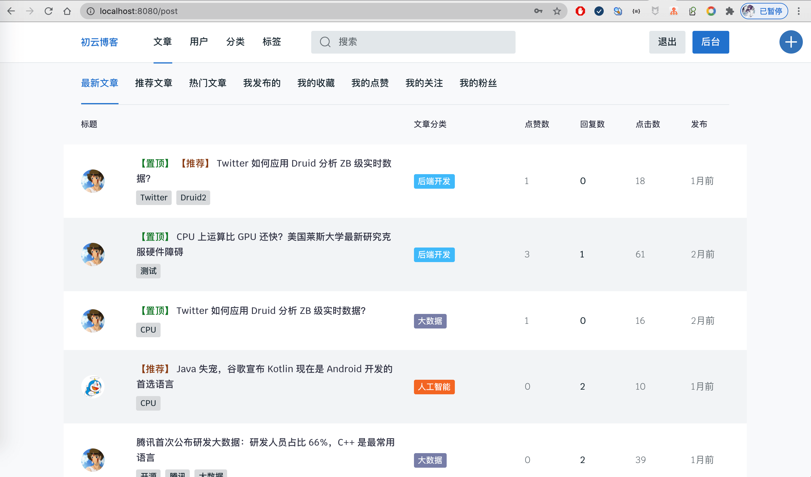
2-推荐文章.png
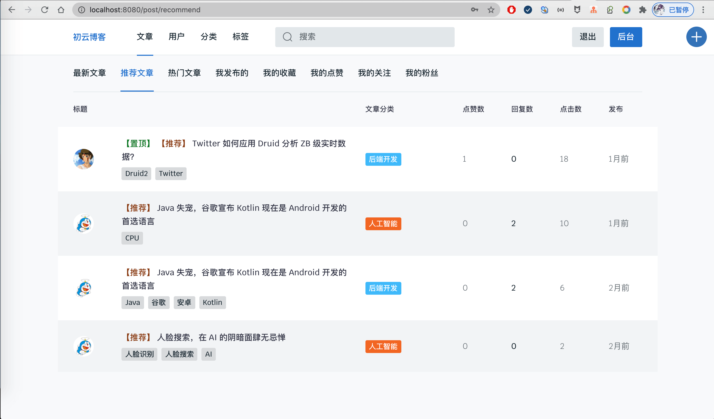
3-热门文章.png
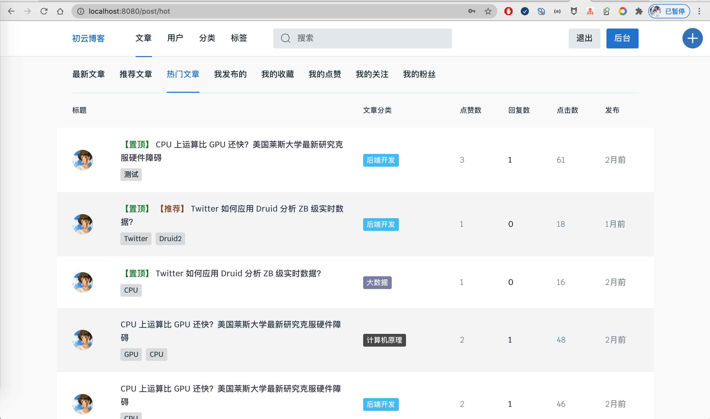
4-我发布的.png

5-我收藏的.png

6-我点赞的.png

7-我的关注.png
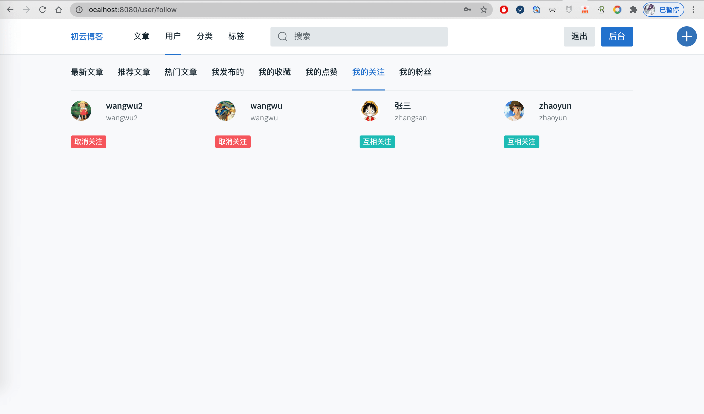
8-我的粉丝.png

9-文章详情1.png

10-文章详情2.png

11-文章评论.png

12-活跃用户.png

13-分类列表.png
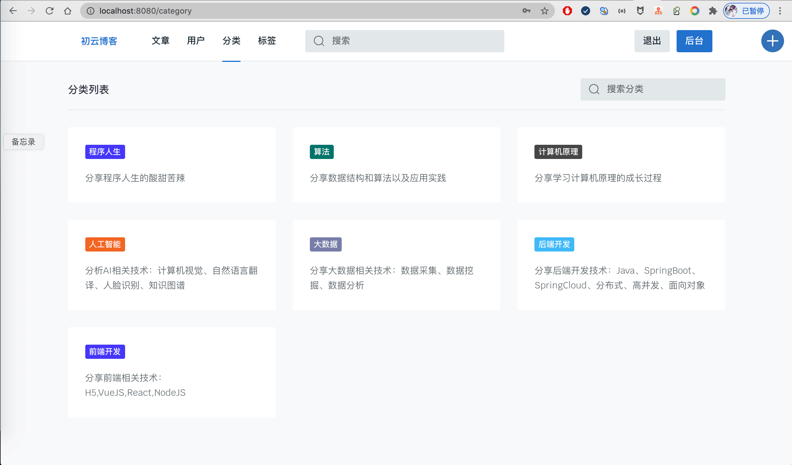
14-标签列表.png

15-用户主页-文章列表.png

16-文章搜索.png
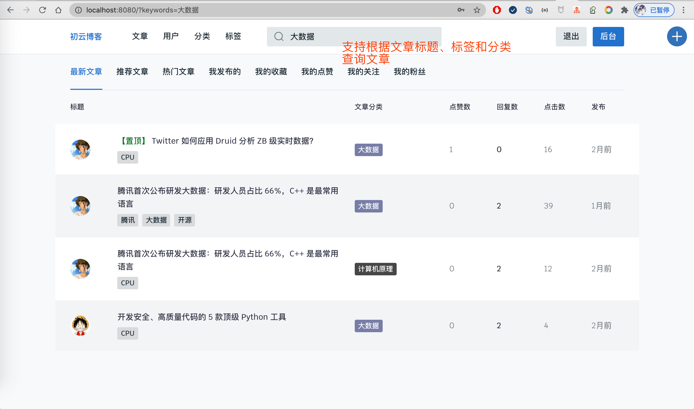
17-登录.png

18-文章管理.png
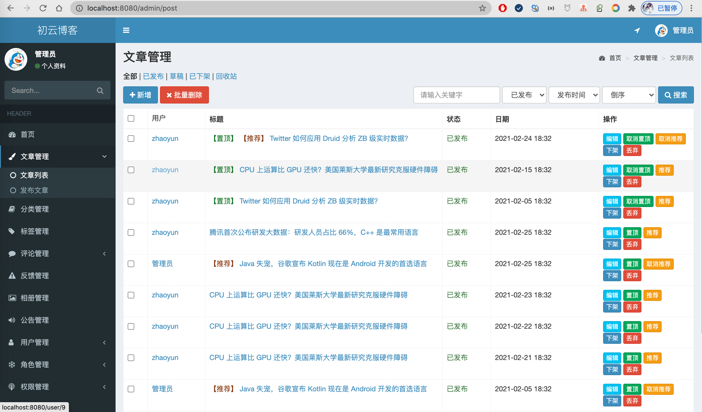
19-文章发布.png
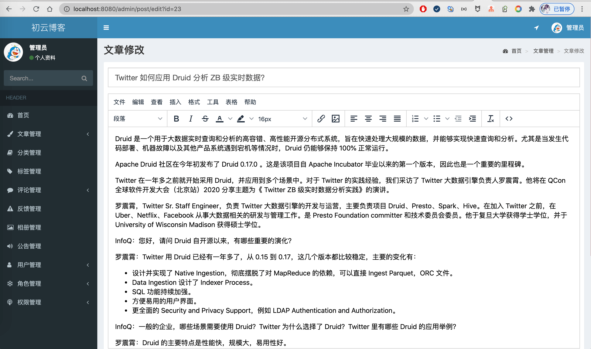
20-分类管理.png

21-标签管理.png
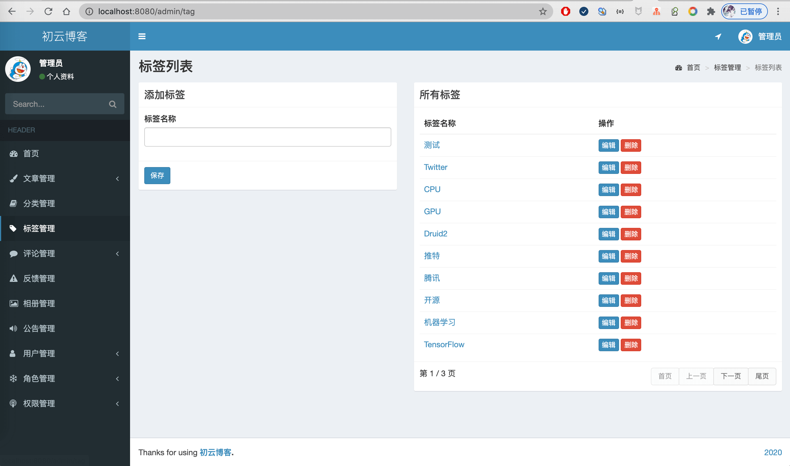
22-评论管理.png

23-反馈管理.png
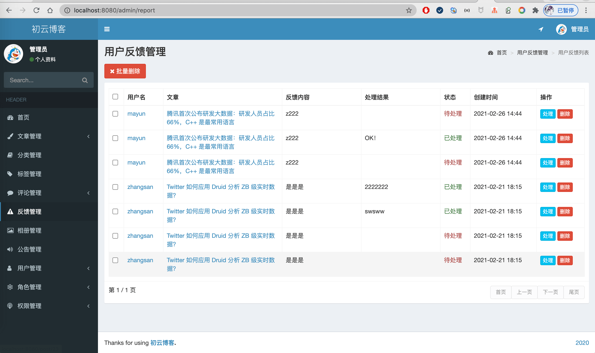
24-用户管理.png

25-用户编辑.png
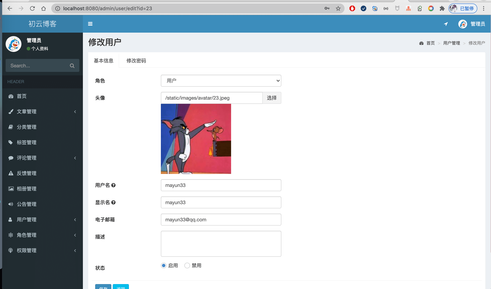
26-普通用户登录后台的文章管理.png
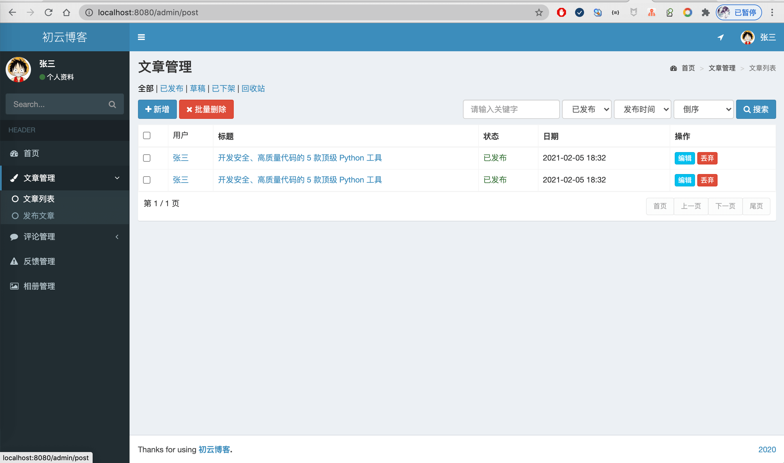

## 联系方式
该项目可用于个人博客使用或者多用户博客使用，毕设等。  
长期更新！大家可以提需求，我可以及时更新！   
支持定制，加功能，减功能   
需要完整代码，联系本人，提供源码，远程部署和问题解答  
微信：847064370   

## 更新历史
- 2021年4月18日 新增验证码、收藏、反馈、点赞等，优化部分功能
- 2021年03月05日 新增相册管理、照片管理、好友管理、公告管理
- ... 更新若干次，同时开发了SSM版本，Dubbo版本，SSMBlogPlus版本
- 2020年04月11日 首次提交，实现基本功能
